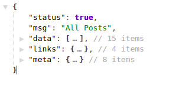

# What is the Api Resource :

A transformation layer that sits between your Eloquent models and the JSON responses .

# First Time Using It:

The first time I am using the api resource , I was confused about the difference between the two classes ,
you will find it in the apiResource of laravel (Resource , Collection) , Ex : PostReource and PostCollection .

### Larave Api Resource has two classes you can simply make them using artisan like that .

```php
php artisan make:resource PostResource
```

This command create class in `App\Http\Resources` extends `JsonResource`

```php
php artisan make:resource PostCollection --collection
```

or

```php
php artisan make:resource PostCollection
```

name of class with suffix collection

this command create class in `App\Http\Resources` extends `ResourceCollection`

so , what is the difference between them ?

| Resource Class                            | Collection Class                          |
| ----------------------------------------- | ----------------------------------------- |
| extends `JsonResource`                    | extends `ResourceCollection`              |
| mapping for single model instance `$post` | mapping for collection of model `$posts`  |
| `new PostResource(Post::find(1));`        | `new PostCollection(Post::paginate())`    |
| cannot paginate data ,                    | can us paginate and return metadata..     |
| doesn't support additional metadata       | with the collection .                     |

# Tutorial :

Suppose you have a new laravel project and make `Post` model and `posts_table` migration
has fields `title,description,user_id` ..

### Create `PostResource` and `PostCollection` :

```php
 php artisan make:resource Posts/PostCollection
 php artisan make:resource Posts/PostResource
```

-   edit `PostResource` `toArray` to be like that :

```php
public function toArray($request)
    {
        return [
            "title"       => $this->title,
            "description" => $this->description,
            "user"        => new UserResource($this->user)
        ];
    }
```
- create `userResource` class
```php
php artisan make:resource Users/UserResource
```
- edit `UserResource` `toArray` to be like that :
```php
 public function toArray($request)
    {
        return [
            "name"  => $this->name,
            "email" => $this->email
        ];
    }
```
- return to `posts` and edit `PostResource` `toArray` :
```php
 public function toArray($request)
    {
        return [
            "status" => true,
            "msg"    => "All Posts",
            "data"   => $this->collection
        ];
    }
```
### Now we are ready to return response posts collection :
- Add this method in `routes/web.php` to quick test
```php
Route::get("test", function () {
    return new PostCollection(Post::paginate());
});
```
- Now run the server into project folder and open this link :
```php
php artisan ser
```
`localhost:8000/test`

## Finally : You will receive this response :

